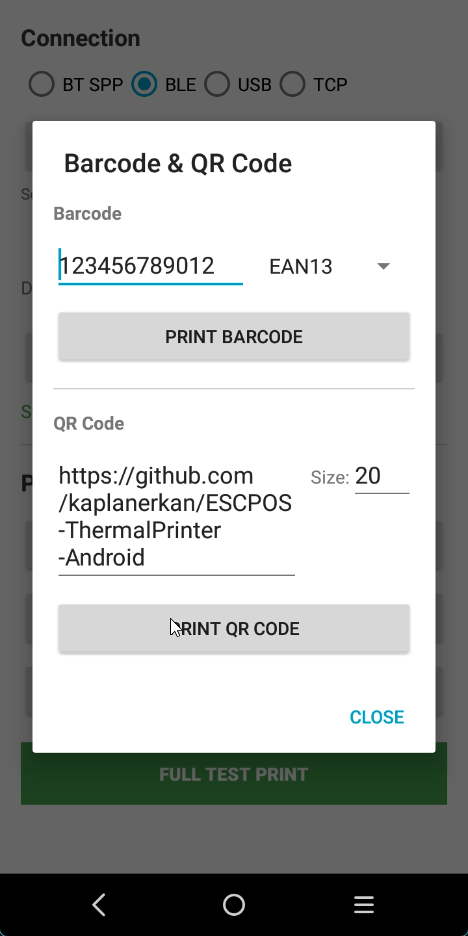
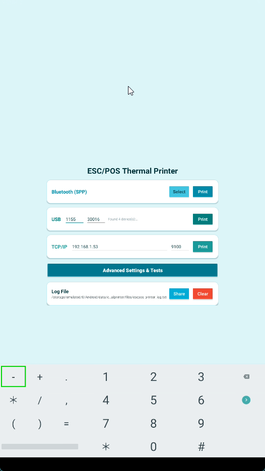
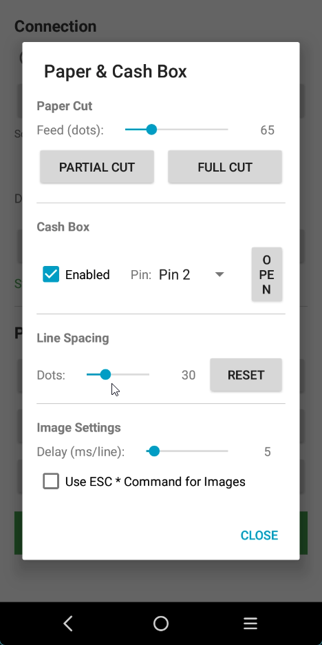
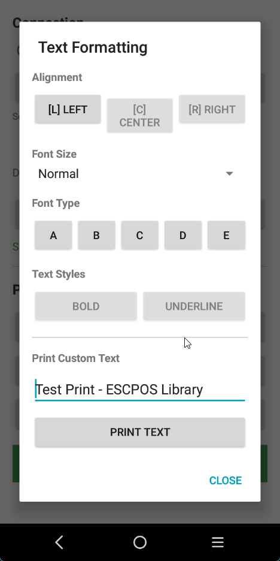
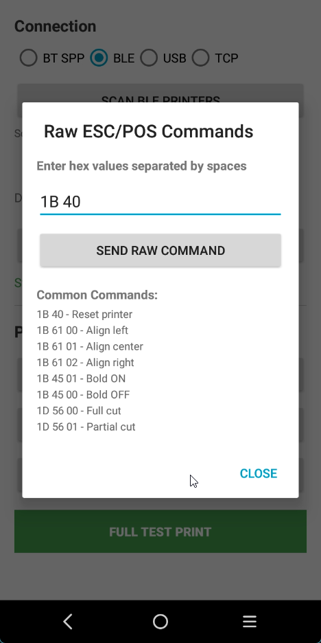
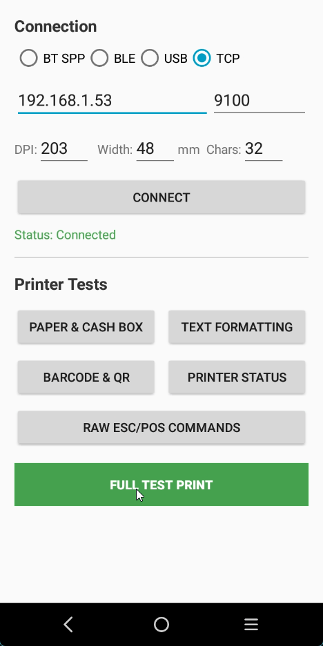
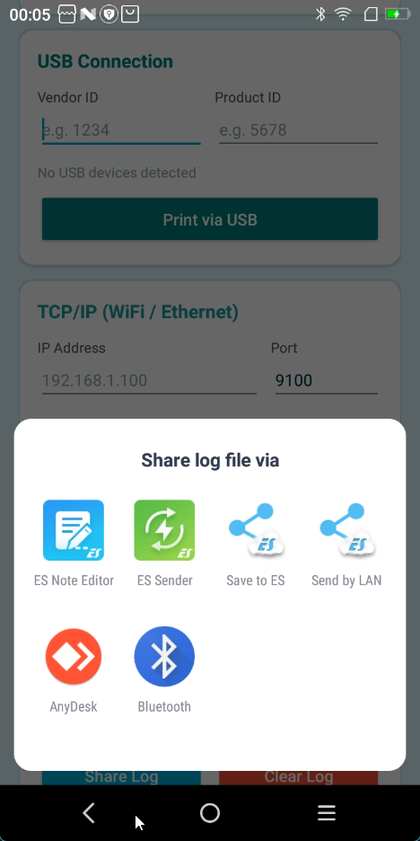
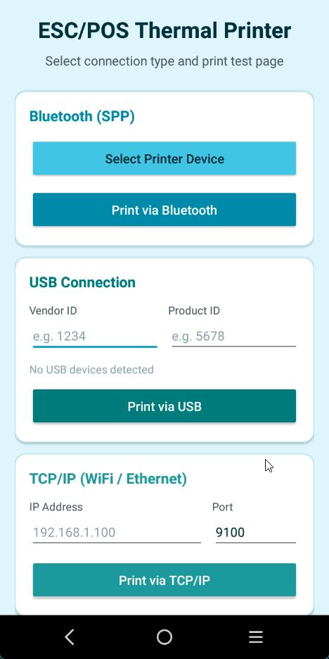
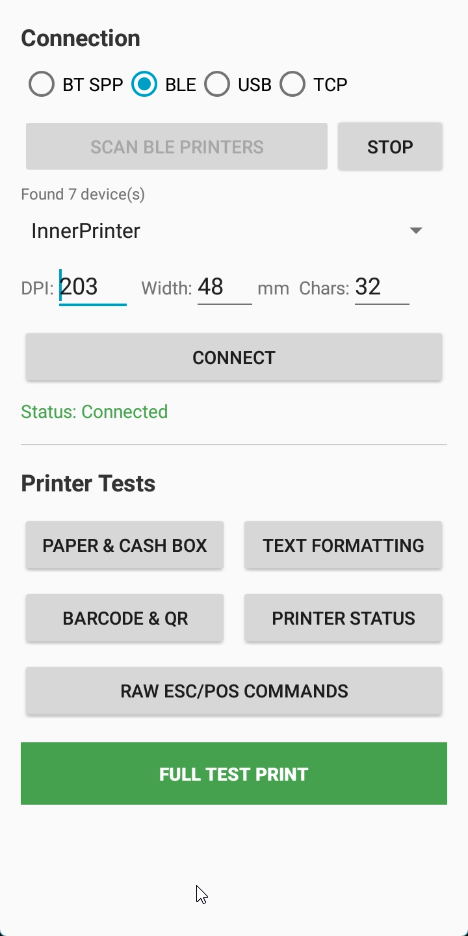
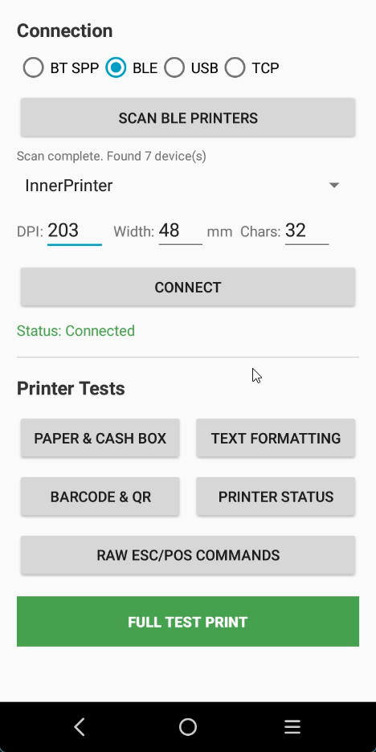

[](https://github.com/kaplanerkan/ESCPOS-ThermalPrinter-Android/actions/workflows/android.yml)
[](https://opensource.org/licenses/MIT)
[](https://github.com/kaplanerkan/ESCPOS-ThermalPrinter-Android/releases/latest)

---

## 📱 Test APK

> **Quick Start:** Download the ready-to-use APK to test the library and demo app!
>
> [](https://github.com/kaplanerkan/ESCPOS-ThermalPrinter-Android/releases/latest)
>
> Download `app-debug.apk` and install it on your device. Test your thermal printer via Bluetooth, USB, or TCP/IP.

---

## Special Thanks

A huge thank you to **Franck Alary** ([@DantSu](https://github.com/DantSu)) for creating this amazing library!

This project is a fork of his excellent work: [DantSu/ESCPOS-ThermalPrinter-Android](https://github.com/DantSu/ESCPOS-ThermalPrinter-Android)

---

> **Fork Note:** This is a maintained fork of [DantSu/ESCPOS-ThermalPrinter-Android](https://github.com/DantSu/ESCPOS-ThermalPrinter-Android) with Android 14+ compatibility, updated dependencies, and bug fixes.

# Android library for ESC/POS Thermal Printer

Useful library to help Android developers to print with (Bluetooth, TCP, USB) ESC/POS thermal printers.

## Screenshots

| | | |
|:---:|:---:|:---:|
|  |  |  |
|  |  |  |
|  |  |  |
|  | | |

## Features

### App Features
- **Fullscreen Immersive Mode** - No toolbar, full screen experience for all devices
- **Responsive Design** - Optimized layouts for phones, tablets (7"+), and large kiosk displays (10"+)
- **Turquoise Modern Theme** - Clean, modern UI with card-based design
- **USB Auto-Detection** - Automatically detects and displays connected USB printer VID/PID
- **Multiple Connection Types** - Bluetooth SPP, Bluetooth LE (BLE), USB, TCP/IP (WiFi/Ethernet)

### Library Features
- **Batch Mode (USB & TCP)** - Buffers all data and sends in one transfer for faster printing
- **Printer Status Query** - Check printer status, paper level, cover state, and errors
- **Cash Drawer Control** - Enable/disable cash box, select pin connector
- **Raw ESC/POS Commands** - Send custom commands with `printRaw()` and `printRawHex()`
- **Font Selection** - Choose between fonts A, B, C, D, E with `<font font='b'>`
- **Strikethrough Text** - Add strikethrough effect with `<s>` tag
- **Image Processing Delay** - Configurable delay to prevent premature paper cutting
- **Line Spacing Control** - Set custom line spacing with `setLineSpacing()`

## Responsive Layout

The app automatically adapts to different screen sizes:

| Screen Size | Layout | Dimensions |
|-------------|--------|------------|
| Phone (< 600dp) | Single column, stacked cards | 24sp title, 48dp buttons |
| Tablet 7"+ (sw600dp) | Two columns (BT + TCP side by side) | 28sp title, 56dp buttons |
| Kiosk 10"+ (sw720dp) | Three columns (BT + USB + TCP) | 32sp title, 64dp buttons |

## Table of contents

- [Android version](#android-version)
- [What's New in v1.0.0](#whats-new-in-v100)
- [Tested printers](#tested-printers)
- [Test It !](#test-it-)
- [Settings & Test Activity](#settings--test-activity)
- [Installation](#installation)
- [Bluetooth](#bluetooth)
- [TCP](#tcp)
- [USB](#usb)
- [Raw ESC/POS Commands](#raw-escpos-commands)
- [Cash Drawer Control](#cash-drawer-control)
- [Printer Status](#printer-status)
- [Charset encoding](#charset-encoding)
- [Formatted text : syntax guide](#formatted-text--syntax-guide)
- [ESC/POS Commands Reference](#escpos-commands-reference)
- [Class list](#class-list)
- [Contributing](#contributing)


## Android version

Developed for SDK version 24 (Android 7.0 Nougat) and above. Supports up to Android 14 (API 34).

## What's New in v1.0.0

This fork includes numerous improvements and bug fixes:

### New Features
- **Batch Mode (USB & TCP)** - Buffers all print data and sends in one transfer for significantly faster printing
- **Fullscreen Immersive Mode** - No toolbar, status bar, or navigation bar for kiosk/POS use
- **Responsive Design** - Adaptive layouts for phones, tablets, and large kiosk displays
- **USB Auto-Detection** - Automatically fills VID/PID when USB printer is connected
- **Modern Turquoise Theme** - Clean, card-based UI design
- **Printer Status Query** - Check printer status, paper level, cover state, and errors (#528)
- **Cash Drawer Control** - Enable/disable cash box, select pin connector (#557)
- **Raw ESC/POS Commands** - Send custom commands with `printRaw()` and `printRawHex()` (#570)
- **Font Selection** - Choose between fonts A, B, C, D, E with `<font font='b'>` (#555)
- **Strikethrough Text** - Add strikethrough effect with `<s>` tag (#556)
- **Image Processing Delay** - Configurable delay to prevent premature paper cutting (#533)

### Bug Fixes
- **Android 14 Compatibility** - Fixed `registerReceiver` crash with `RECEIVER_NOT_EXPORTED` flag
- **Paper Cutting** - Fixed premature cutting with proper feed-before-cut command (#563)
- **Bluetooth Half Printing** - Added chunked data sending for reliable Bluetooth printing (#564)
- **TCP Timeout** - Fixed connection timeout (was 30ms, now 5000ms)
- **Less-than Symbol** - Fixed `<` character being interpreted as tag (#436)
- **Barcode/QR Centering** - Fixed alignment issues when printing barcode then QR code (#542)
- **AGP 8.x Compatibility** - Fixed "SoftwareComponent 'release' not found" error (#567)
- **USB Connection** - Improved compatibility with non-standard USB printers (#498)

### Performance
- **Optimized Image Processing** - `bitmapToBytes()` uses batch pixel retrieval for faster processing (#490)
- **Line Spacing Control** - Set custom line spacing with `setLineSpacing()`

### Updates
- Gradle 8.2, Android Gradle Plugin 8.1.2
- Java 17, compileSdk/targetSdk 34
- Updated dependencies (appcompat 1.7.0, zxing 3.5.3)
- Kotlin DSL for build scripts

## Error Logging

All printer connection errors and operations are logged for debugging purposes:

### Logcat
Filter by tags containing: `DeviceConnection`, `TcpConnection`, `UsbConnection`, `BluetoothConnection`, `BluetoothLeConnection`, `BleDeviceScanner`

### Log File
Logs are automatically saved to app-specific storage:
**`/storage/emulated/0/Android/data/com.karsu.thermalprinter/files/escpos_printer_log.txt`**

- The log file is automatically rotated when it exceeds 5MB
- Contains timestamps, log levels, tags, and detailed error messages
- No storage permission required (uses app-specific external storage)

### Viewing Logs
```bash
# Via ADB
adb pull /sdcard/Android/data/com.karsu.thermalprinter/files/escpos_printer_log.txt

# Or use any file manager app to navigate to the app's files folder
```

### USB Device Debugging

When USB printing fails, the app logs detailed USB device information to help diagnose connection issues:

```
========== USB DEVICE SCAN ==========
Total USB devices connected: 2
---
Device: /dev/bus/usb/002/024
  Name: USB Touchscreen
  VID: 44953 (0xAF79) PID: 32770 (0x8002)
  Class: HID
  Interfaces: 1
    Interface 0: class=HID endpoints=1
  Is Printer: NO
---
Device: /dev/bus/usb/001/005
  Name: POS-58
  VID: 1234 (0x04D2) PID: 5678 (0x162E)
  Class: PRINTER
  Interfaces: 1
    Interface 0: class=PRINTER endpoints=2
  Is Printer: YES
========== END USB SCAN ==========
```

**USB Class Types:**
| Class | Name | Description |
|-------|------|-------------|
| 0 | PER_INTERFACE | Class defined per interface |
| 3 | HID | Human Interface Device (keyboard, mouse, touchscreen) |
| 7 | PRINTER | Printer device |
| 8 | MASS_STORAGE | USB storage device |
| 255 | VENDOR_SPEC | Vendor-specific (some POS printers use this) |

**Troubleshooting:**
- If your printer shows as `HID` or another non-printer class, it may not be compatible
- Many thermal printers use `PRINTER` (class 7) or `VENDOR_SPEC` (class 255)
- Check the VID/PID values and enter them manually in the app if auto-detection fails

## Tested printers

1. [HOIN HOP H58 Thermal Printer ESC/POS](https://www.gearbest.com/printers/pp_662658.html).
2. [XPRINTER XP-P300](https://xprinter.vn/xprinter-xp-p300-may-in-hoa-don-di-dong-bluetooth/).
3. [MUNBYN IMP001](https://www.munbyn.com/collections/portable-receipt-printer/products/58mm-bluetooth-thermal-printer-imp001).
4. [JP-Q2 POS Terminal PDA](https://www.aliexpress.com/item/32971775060.html) (Embedded printer is configured as Bluetooth device)
5. [MUNBYN ITPP047](https://www.munbyn.com/products/munbyn-itpp047-wifi-thermal-printer) (tested over USB)

## Test it !

To test this library, it's pretty simple !

- Create a directory and open a terminal inside
- Run `git clone https://github.com/DantSu/ESCPOS-ThermalPrinter-Android.git .`
- Open the directory with Android Studio
- Test it !

## Settings & Test Activity

The sample app includes a comprehensive Settings & Test Activity that allows you to test all library features live on a real printer without writing any code.

### Features

Access it by clicking the "Advanced Settings & Tests" button in the main activity.

**Connection Management:**
- Bluetooth printer selection and connection
- Bluetooth LE (BLE) printer scanning and connection
- USB printer auto-detection with VID/PID display
- TCP/IP connection with configurable IP and port
- Real-time connection status display

**Printer Configuration:**
- DPI setting (default: 203)
- Paper width in mm (default: 48)
- Characters per line (default: 32)

**Print Tests:**
- Paper cut control (partial/full) with adjustable feed
- Cash drawer control (enable/disable, pin selection)
- Line spacing adjustment with live preview
- Image processing delay configuration
- ESC * command mode toggle

**Text Formatting Tests:**
- Text alignment (Left, Center, Right)
- Font size selection (Normal, Tall, Wide, Big)
- Font type selection (A, B, C, D, E)
- Bold and underline toggles
- Custom text input for testing

**Barcode & QR Code Tests:**
- Barcode printing with type selection (EAN13, EAN8, UPCA, UPCE, CODE128, etc.)
- QR Code printing with configurable size
- Custom data input for both

**Printer Status:**
- Query printer status (online, paper, cover, drawer, errors)
- Real-time status display

**Raw Commands:**
- Send raw ESC/POS commands in hex format
- Useful for testing custom commands

**Full Test Print:**
- One-click comprehensive test that prints:
  - All alignment options
  - All font sizes
  - Text styles (bold, underline)
  - Special characters (< > etc.)
  - Sample barcode and QR code

### Using the Settings Activity in Your App

To include the Settings Activity in your own app:

1. Enable ViewBinding in your app's `build.gradle`:
```gradle
android {
    buildFeatures {
        viewBinding true
    }
}
```

2. Copy the activity files:
   - `res/layout/activity_settings.xml`
   - `java/.../SettingsActivity.java`
   - `java/.../dialogs/*` (dialog helper classes)

3. Add to `AndroidManifest.xml`:
```xml
<activity
    android:name=".SettingsActivity"
    android:label="Settings &amp; Test" />
```

4. Launch from your app:
```java
startActivity(new Intent(this, SettingsActivity.class));
```

## Installation

### Option 1: Use the original library (via JitPack)

For the original library by DantSu, follow the instructions at:
[DantSu/ESCPOS-ThermalPrinter-Android](https://github.com/DantSu/ESCPOS-ThermalPrinter-Android#installation)

### Option 2: Use this fork (clone or download)

This fork includes additional features and bug fixes. To use it:

1. Clone or download this repository
2. Import the `escposprinter` module into your Android project
3. Add the module as a dependency in your app's `build.gradle`:

```gradle
dependencies {
    implementation project(':escposprinter')
}
```

## Bluetooth

### Bluetooth permission

Be sure to have `<uses-permission android:name="android.permission.BLUETOOTH" />`, `<uses-permission android:name="android.permission.BLUETOOTH_ADMIN" />`, `<uses-permission android:name="android.permission.BLUETOOTH_CONNECT" />`, `<uses-permission android:name="android.permission.BLUETOOTH_SCAN" />` in your `AndroidManifest.xml`.

Also, you have to check the bluetooth permission in your app like this :

```java
if (android.os.Build.VERSION.SDK_INT < android.os.Build.VERSION_CODES.S && ContextCompat.checkSelfPermission(this, Manifest.permission.BLUETOOTH) != PackageManager.PERMISSION_GRANTED) {
    ActivityCompat.requestPermissions(this, new String[]{Manifest.permission.BLUETOOTH}, MainActivity.PERMISSION_BLUETOOTH);
} else if (android.os.Build.VERSION.SDK_INT < android.os.Build.VERSION_CODES.S && ContextCompat.checkSelfPermission(this, Manifest.permission.BLUETOOTH_ADMIN) != PackageManager.PERMISSION_GRANTED) {
    ActivityCompat.requestPermissions(this, new String[]{Manifest.permission.BLUETOOTH_ADMIN}, MainActivity.PERMISSION_BLUETOOTH_ADMIN);
} else if (android.os.Build.VERSION.SDK_INT >= android.os.Build.VERSION_CODES.S && ContextCompat.checkSelfPermission(this, Manifest.permission.BLUETOOTH_CONNECT) != PackageManager.PERMISSION_GRANTED) {
    ActivityCompat.requestPermissions(this, new String[]{Manifest.permission.BLUETOOTH_CONNECT}, MainActivity.PERMISSION_BLUETOOTH_CONNECT);
} else if (android.os.Build.VERSION.SDK_INT >= android.os.Build.VERSION_CODES.S && ContextCompat.checkSelfPermission(this, Manifest.permission.BLUETOOTH_SCAN) != PackageManager.PERMISSION_GRANTED) {
    ActivityCompat.requestPermissions(this, new String[]{Manifest.permission.BLUETOOTH_SCAN}, MainActivity.PERMISSION_BLUETOOTH_SCAN);
} else {
    // Your code HERE
}
```

### Bluetooth code example

The code below is an example to write in your activity :

```java
EscPosPrinter printer = new EscPosPrinter(BluetoothPrintersConnections.selectFirstPaired(), 203, 48f, 32);
printer
    .printFormattedText(
        "[C]" + PrinterTextParserImg.bitmapToHexadecimalString(printer, this.getApplicationContext().getResources().getDrawableForDensity(R.drawable.logo, DisplayMetrics.DENSITY_MEDIUM))+"</img>\n" +
        "[L]\n" +
        "[C]<u><font size='big'>ORDER N°045</font></u>\n" +
        "[L]\n" +
        "[C]================================\n" +
        "[L]\n" +
        "[L]<b>BEAUTIFUL SHIRT</b>[R]9.99e\n" +
        "[L]  + Size : S\n" +
        "[L]\n" +
        "[L]<b>AWESOME HAT</b>[R]24.99e\n" +
        "[L]  + Size : 57/58\n" +
        "[L]\n" +
        "[C]--------------------------------\n" +
        "[R]TOTAL PRICE :[R]34.98e\n" +
        "[R]TAX :[R]4.23e\n" +
        "[L]\n" +
        "[C]================================\n" +
        "[L]\n" +
        "[L]<font size='tall'>Customer :</font>\n" +
        "[L]Raymond DUPONT\n" +
        "[L]5 rue des girafes\n" +
        "[L]31547 PERPETES\n" +
        "[L]Tel : +33801201456\n" +
        "[L]\n" +
        "[C]<barcode type='ean13' height='10'>831254784551</barcode>\n" +
        "[C]<qrcode size='20'>https://dantsu.com/</qrcode>"
    );
```

Below a picture of the receipt printed with the code above :


## TCP

### TCP permission

Be sure to have `<uses-permission android:name="android.permission.INTERNET"/>` in your `AndroidManifest.xml`.

### TCP code example

The code below is an example to write in your activity :

```java
new Thread(new Runnable() {
    public void run() {
        try {
            EscPosPrinter printer = new EscPosPrinter(new TcpConnection("192.168.1.3", 9300, 15), 203, 48f, 32);
            printer
                .printFormattedText(
                    "[C]" + PrinterTextParserImg.bitmapToHexadecimalString(printer, getApplicationContext().getResources().getDrawableForDensity(R.drawable.logo, DisplayMetrics.DENSITY_MEDIUM)) + "</img>\n" +
                    "[L]\n" +
                    "[C]<u><font size='big'>ORDER N°045</font></u>\n" +
                    "[L]\n" +
                    "[C]================================\n" +
                    "[L]\n" +
                    "[L]<b>BEAUTIFUL SHIRT</b>[R]9.99e\n" +
                    "[L]  + Size : S\n" +
                    "[L]\n" +
                    "[L]<b>AWESOME HAT</b>[R]24.99e\n" +
                    "[L]  + Size : 57/58\n" +
                    "[L]\n" +
                    "[C]--------------------------------\n" +
                    "[R]TOTAL PRICE :[R]34.98e\n" +
                    "[R]TAX :[R]4.23e\n" +
                    "[L]\n" +
                    "[C]================================\n" +
                    "[L]\n" +
                    "[L]<font size='tall'>Customer :</font>\n" +
                    "[L]Raymond DUPONT\n" +
                    "[L]5 rue des girafes\n" +
                    "[L]31547 PERPETES\n" +
                    "[L]Tel : +33801201456\n" +
                    "[L]\n" +
                    "[C]<barcode type='ean13' height='10'>831254784551</barcode>\n" +
                    "[C]<qrcode size='20'>https://dantsu.com/</qrcode>"
                );
        } catch (Exception e) {
            e.printStackTrace();
        }
    }
}).start();
```

## USB

### USB permission

Be sure to have `<uses-feature android:name="android.hardware.usb.host" />` in your `AndroidManifest.xml`.

For automatic USB device detection, add an intent-filter to your activity:

```xml
<activity android:name=".MainActivity">
    <intent-filter>
        <action android:name="android.hardware.usb.action.USB_DEVICE_ATTACHED" />
    </intent-filter>
    <meta-data
        android:name="android.hardware.usb.action.USB_DEVICE_ATTACHED"
        android:resource="@xml/device_filter" />
</activity>
```

Create `res/xml/device_filter.xml`:
```xml
<?xml version="1.0" encoding="utf-8"?>
<resources>
    <!-- USB Printer class -->
    <usb-device class="7" />
    <!-- Vendor specific (many POS printers) -->
    <usb-device class="255" />
</resources>
```

You have to check the USB permission in your app like this :

```java
private static final String ACTION_USB_PERMISSION = "com.android.example.USB_PERMISSION";
private final BroadcastReceiver usbReceiver = new BroadcastReceiver() {
    public void onReceive(Context context, Intent intent) {
        String action = intent.getAction();
        if (MainActivity.ACTION_USB_PERMISSION.equals(action)) {
            synchronized (this) {
                UsbManager usbManager = (UsbManager) getSystemService(Context.USB_SERVICE);
                UsbDevice usbDevice = (UsbDevice) intent.getParcelableExtra(UsbManager.EXTRA_DEVICE);
                if (intent.getBooleanExtra(UsbManager.EXTRA_PERMISSION_GRANTED, false)) {
                    if (usbManager != null && usbDevice != null) {
                        // YOUR PRINT CODE HERE
                    }
                }
            }
        }
    }
};

public void printUsb() {
    UsbConnection usbConnection = UsbPrintersConnections.selectFirstConnected(this);
    UsbManager usbManager = (UsbManager) this.getSystemService(Context.USB_SERVICE);
    if (usbConnection != null && usbManager != null) {
        PendingIntent permissionIntent = PendingIntent.getBroadcast(
            this,
            0,
            new Intent(MainActivity.ACTION_USB_PERMISSION),
            android.os.Build.VERSION.SDK_INT >= android.os.Build.VERSION_CODES.S ? PendingIntent.FLAG_MUTABLE : 0
        );
        IntentFilter filter = new IntentFilter(MainActivity.ACTION_USB_PERMISSION);
        if (android.os.Build.VERSION.SDK_INT >= android.os.Build.VERSION_CODES.TIRAMISU) {
            registerReceiver(this.usbReceiver, filter, Context.RECEIVER_NOT_EXPORTED);
        } else {
            registerReceiver(this.usbReceiver, filter);
        }
        usbManager.requestPermission(usbConnection.getDevice(), permissionIntent);
    }
}
```

### USB code example

The code below is an example to write in your activity :

```java
EscPosPrinter printer = new EscPosPrinter(new UsbConnection(usbManager, usbDevice), 203, 48f, 32);
printer
    .printFormattedText(
        "[C]" + PrinterTextParserImg.bitmapToHexadecimalString(printer, this.getApplicationContext().getResources().getDrawableForDensity(R.drawable.logo, DisplayMetrics.DENSITY_MEDIUM))+"</img>\n" +
        "[L]\n" +
        "[C]<u><font size='big'>ORDER N°045</font></u>\n" +
        "[L]\n" +
        "[C]================================\n" +
        "[L]\n" +
        "[L]<b>BEAUTIFUL SHIRT</b>[R]9.99e\n" +
        "[L]  + Size : S\n" +
        "[L]\n" +
        "[L]<b>AWESOME HAT</b>[R]24.99e\n" +
        "[L]  + Size : 57/58\n" +
        "[L]\n" +
        "[C]--------------------------------\n" +
        "[R]TOTAL PRICE :[R]34.98e\n" +
        "[R]TAX :[R]4.23e\n" +
        "[L]\n" +
        "[C]================================\n" +
        "[L]\n" +
        "[L]<font size='tall'>Customer :</font>\n" +
        "[L]Raymond DUPONT\n" +
        "[L]5 rue des girafes\n" +
        "[L]31547 PERPETES\n" +
        "[L]Tel : +33801201456\n" +
        "[L]\n" +
        "[C]<barcode type='ean13' height='10'>831254784551</barcode>\n" +
        "[C]<qrcode size='20'>https://dantsu.com/</qrcode>"
    );
```


## Raw ESC/POS Commands

You can send raw ESC/POS commands directly to the printer for advanced control:

```java
// Using byte array
byte[] rawCommand = new byte[]{0x1B, 0x40}; // Initialize printer
printer.printRaw(rawCommand);

// Using hexadecimal string (spaces, 0x prefix, and commas are optional)
printer.printRawHex("1B 40");           // Initialize printer
printer.printRawHex("1B611B6101");      // Align center
printer.printRawHex("0x1B,0x45,0x01");  // Bold on

// Buffered writing (write multiple commands, then send once)
printer.write(new byte[]{0x1B, 0x40})   // Reset
       .write(new byte[]{0x1B, 0x61, 0x01}) // Center align
       .send();

// Access low-level commands
EscPosPrinterCommands commands = printer.getPrinterCommands();
commands.write(EscPosPrinterCommands.TEXT_ALIGN_CENTER);
commands.printText("Centered Text");
commands.send();
```

### Convert hex string to bytes

```java
byte[] bytes = EscPosPrinterCommands.hexStringToBytes("1B 40 1B 61 01");
```

## Cash Drawer Control

Many POS printers have a cash drawer (cash box) connected via RJ11/RJ12 connector. You can control it programmatically:

### Basic usage

```java
// Open cash drawer after printing
printer.printFormattedTextAndOpenCashBox("[C]RECEIPT\n[L]Total: $10.00\n", 20f);

// Open cash drawer without printing
printer.openCashBox();

// Open cash drawer using pin 5 instead of pin 2
printer.openCashBox(1);  // 0 = pin 2, 1 = pin 5
```

### Disable cash drawer

You can disable the cash drawer to prevent it from opening (useful for reprints or kitchen printers):

```java
// Disable cash drawer
printer.setCashBoxEnabled(false);

// This will print but NOT open the cash drawer
printer.printFormattedTextAndOpenCashBox("[C]KITCHEN COPY\n", 20f);

// Re-enable cash drawer
printer.setCashBoxEnabled(true);
```

### Low-level access

```java
// Using EscPosPrinterCommands directly
EscPosPrinterCommands commands = printer.getPrinterCommands();
commands.openCashBox();  // Opens using pin 2

// Or send raw command
printer.printRawHex("1B 70 00 19 FA");  // ESC p 0 25 250 (pin 2)
printer.printRawHex("1B 70 01 19 FA");  // ESC p 1 25 250 (pin 5)
```

## Printer Status

You can query the printer status to check for errors, paper status, and more. This is useful for remote monitoring of printers.

**Note:** Not all printers support status queries. USB connections typically don't support reading. Bluetooth and TCP connections usually support it.

### Basic usage

```java
// Check if status query is supported
if (printer.supportsStatusQuery()) {
    PrinterStatus status = printer.queryStatus();

    if (status.isReady()) {
        // Printer is ready to print
        printer.printFormattedText("[C]Hello World\n");
    } else {
        // Check specific issues
        if (status.isPaperEnd()) {
            Log.e("Printer", "Out of paper!");
        }
        if (status.isCoverOpen()) {
            Log.e("Printer", "Cover is open!");
        }
        if (status.isErrorOccurred()) {
            Log.e("Printer", "Printer error occurred");
        }
    }
}
```

### Available status checks

```java
PrinterStatus status = printer.queryStatus();

// General status
status.isOnline();           // Printer is online
status.isReady();            // Ready to print (no errors, has paper)

// Cover and drawer
status.isCoverOpen();        // Printer cover is open
status.isDrawerOpen();       // Cash drawer is open

// Paper status
status.isPaperNearEnd();     // Paper roll is running low
status.isPaperEnd();         // No paper
status.isPaperEndError();    // Paper end caused an error

// Error status
status.isErrorOccurred();    // Any error occurred
status.isRecoverableError(); // Error that can be recovered
status.isUnrecoverableError(); // Serious error
status.isAutocutterError();  // Cutter jam or error
status.isAutoRecoverableError(); // Will auto-recover

// Check if query succeeded
status.hasAnyStatus();       // At least one query succeeded
status.isPaperStatusQueried(); // Paper status was queried
```

### Query with custom timeout

```java
// Default timeout is 500ms
PrinterStatus status = printer.queryStatus();

// Custom timeout (e.g., 1000ms for slow connections)
PrinterStatus status = printer.queryStatus(1000);

// Query only paper status (faster)
PrinterStatus paperStatus = printer.queryPaperStatus(500);
```

### Remote monitoring example

```java
// Periodically check printer status in a background thread
new Thread(() -> {
    while (monitoring) {
        try {
            PrinterStatus status = printer.queryStatus(1000);

            if (status.isPaperNearEnd()) {
                notifyUser("Paper is running low!");
            }
            if (status.isPaperEnd()) {
                notifyUser("Printer is out of paper!");
            }
            if (!status.isOnline()) {
                notifyUser("Printer is offline!");
            }

            Thread.sleep(30000); // Check every 30 seconds
        } catch (Exception e) {
            e.printStackTrace();
        }
    }
}).start();
```

## Charset encoding

To change charset encoding of the printer, use `EscPosCharsetEncoding` class :

```java
EscPosPrinter printer = new EscPosPrinter(deviceConnection, 203, 48f, 32, new EscPosCharsetEncoding("windows-1252", 16));
```

`escPosCharsetId` may change with printer model.
[Follow this link to find `escPosCharsetId` that works with many printers](https://www.epson-biz.com/modules/ref_escpos/index.php?content_id=32)

### Special Characters (₹, €, etc.)

Some currency symbols like Indian Rupee (₹) are not available in standard thermal printer charsets. Here are solutions:

**Option 1: Print as image (most reliable)**

```java
// Create a small bitmap with the ₹ symbol
Bitmap rupeeBitmap = Bitmap.createBitmap(24, 24, Bitmap.Config.ARGB_8888);
Canvas canvas = new Canvas(rupeeBitmap);
Paint paint = new Paint();
paint.setTextSize(20);
paint.setColor(Color.BLACK);
paint.setAntiAlias(true);
canvas.drawColor(Color.WHITE);
canvas.drawText("₹", 2, 20, paint);

// Convert to hex string and use in formatted text
String rupeeHex = PrinterTextParserImg.bitmapToHexadecimalString(printer, rupeeBitmap);
printer.printFormattedText("[L]" + rupeeHex + "</img> 1,299.00\n");
```

**Option 2: Use text replacement**

```java
String price = "₹1,299.00";
// Replace ₹ with "Rs." for printers without symbol support
String printablePrice = price.replace("₹", "Rs.");
printer.printFormattedText("[L]" + printablePrice + "\n");
```

**Option 3: Try different charset encodings**

Some printers support special charsets. Try charset ID 20-30 range:

```java
// Test different charset IDs to find one that supports your symbols
EscPosPrinter printer = new EscPosPrinter(
    connection, 203, 48f, 32,
    new EscPosCharsetEncoding("UTF-8", 28)  // Try different IDs
);
```

## Formatted text : syntax guide

### New line

Use `\n` to create a new line of text.

### Text alignment and column separation

Add an alignment tag on a same line of text implicitly create a new column.

Column alignment tags :

- `[L]` : left side alignment
- `[C]` : center alignment
- `[R]` : right side alignment

Example :

- `[L]Some text` : One column aligned to left
- `[C]Some text` : One column aligned to center
- `[R]Some text` : One column aligned to right
- `[L]Some text[L]Some other text` : Two columns aligned to left. `Some other text` starts in the center of the paper.
- `[L]Some text[R]Some other text` : Two columns, first aligned to left, second aligned to right. `Some other text` is printed at the right of paper.
- `[L]Some[R]text[R]here` : Three columns.
- `[L][R]text[R]here` : Three columns. The first is empty but it takes a third of the available space.

### Font

#### Size

`<font></font>` tag allows you to change the font size and color. Default size is `normal` / `black`.

- `<font size='normal'>Some text</font>` : Normal size
- `<font size='wide'>Some text</font>` : Double width of medium size
- `<font size='tall'>Some text</font>` : Double height of medium size
- `<font size='big'>Some text</font>` : Double width and height of medium size
- `<font size='big-2'>Some text</font>` : 3 x width and height
- `<font size='big-3'>Some text</font>` : 4 x width and height
- `<font size='big-4'>Some text</font>` : 5 x width and height
- `<font size='big-5'>Some text</font>` : 6 x width and height
- `<font size='big-6'>Some text</font>` : 7 x width and height

- `<font color='black'>Some text</font>` : black text - white background
- `<font color='bg-black'>Some text</font>` : white text - black background
- `<font color='red'>Some text</font>` : red text - white background (Not working on all printer)
- `<font color='bg-red'>Some text</font>` : white text - red background (Not working on all printer)

#### Font Type

You can select different font types (A, B, C, D, E). Note that not all printers support all fonts - most only support A and B.

- `<font font='a'>Some text</font>` : Font A (default, usually 12x24 dots)
- `<font font='b'>Some text</font>` : Font B (usually 9x17 dots, smaller)
- `<font font='c'>Some text</font>` : Font C (if supported by printer)
- `<font font='d'>Some text</font>` : Font D (if supported by printer)
- `<font font='e'>Some text</font>` : Font E (if supported by printer)

You can combine font attributes:
- `<font size='big' font='b'>Big text in Font B</font>`
- `<font color='red' font='a'>Red text in Font A</font>`

#### Bold

`<b></b>` tag allows you to change the font weight.

- `<b>Some text</b>`

#### Underline

`<u></u>` tag allows you to underline the text.

- `<u>Some text</u>` text underlined
- `<u type='double'>Some text</u>` text double-strike (Not working on all printer)

#### Strikethrough

`<s></s>` tag allows you to add strikethrough effect to text.

- `<s>Some text</s>` text with strikethrough

**Note:** Strikethrough uses Unicode combining characters (U+0336). This may not work on all printers. If your printer doesn't support it, consider using text replacement like `~~cancelled~~` or printing the text with a line image overlay.

### Image

`</img>` tag allows you to print image. Inside the tag you need to write a hexadecimal string of an image.

Use `PrinterTextParserImg.bitmapToHexadecimalString` to convert `Drawable`, `BitmapDrawable` or `Bitmap` to hexadecimal string.

- ``hexadecimal string of an image`</img>`

#### Image Processing Delay

If you experience issues with paper cutting before the image finishes printing, you can adjust the image processing delay:

```java
// Increase delay if paper cuts too early after image printing
printer.setImageProcessingDelay(10);  // 10ms per line (default: 5ms)

// For slow printers, increase further
printer.setImageProcessingDelay(20);  // 20ms per line
```

The default delay is 5ms per line of the image. For a 200-line image, this adds 1 second of processing time after the image data is sent, ensuring the printer has time to complete printing before subsequent commands (like paper cut) are executed.

**WARNING** : This tag has several constraints :

- A line that contains `</img>` can have only one alignment tag and it must be at the beginning of the line.
- `` must be directly preceded by nothing or an alignment tag (`[L][C][R]`).
- `</img>` must be directly followed by a new line `\n`.
- You can't write text on a line that contains `</img>`.
- Maximum height of printed image is 256px, If you want to print larger bitmap. Please refer to this solution: [#70](https://github.com/DantSu/ESCPOS-ThermalPrinter-Android/issues/70#issuecomment-714390014)

### Barcode

`<barcode></barcode>` tag allows you to print a barcode. Inside the tag you need to write the code number to print.

- `<barcode>451278452159</barcode>` : **(12 numbers)**
Prints a EAN13 barcode (height: 10mm, width: ~70% printer width, text: displayed below).
- `<barcode type='ean8'>4512784</barcode>` : **(7 numbers)**
Prints a EAN8 barcode (height: 10mm, width: ~70% printer width, text: displayed below).
- `<barcode type='upca' height='20'>4512784521</barcode>` : **(11 numbers)**
Prints a UPC-A barcode (height: 20mm, width: ~70% printer width, text: displayed below).
- `<barcode type='upce' height='25' width='50' text='none'>512789</barcode>` : **(6 numbers)**
Prints a UPC-E barcode (height: 25mm, width: ~50mm, text: hidden).
- `<barcode type='128' width='40' text='above'>DantSu</barcode>` : **(string)**
Prints a barcode 128 (height: 10mm, width: ~40mm, text: displayed above).

**WARNING** : This tag has several constraints :

- A line that contains `<barcode></barcode>` can have only one alignment tag and it must be at the beginning of the line.
- `<barcode>` must be directly preceded by nothing or an alignment tag (`[L][C][R]`).
- `</barcode>` must be directly followed by a new line `\n`.
- You can't write text on a line that contains `<barcode></barcode>`.

### QR Code

`<qrcode></qrcode>` tag allows you to print a QR code. Inside the tag you need to write the QR code data.

- `<qrcode>https://dantsu.com/</qrcode>` :
Prints a QR code with a width and height of 20 millimeters.
- `<qrcode size='25'>123456789</qrcode>` :
Prints a QR code with a width and height of 25 millimeters.

**WARNING** : This tag has several constraints :

- A line that contains `<qrcode></qrcode>` can have only one alignment tag and it must be at the beginning of the line.
- `<qrcode>` must be directly preceded by nothing or an alignment tag (`[L][C][R]`).
- `</qrcode>` must be directly followed by a new line `\n`.
- You can't write text on a line that contains `<qrcode></qrcode>`.

## ESC/POS Commands Reference

This section provides a quick reference for ESC/POS commands used by thermal printers.

### Basic Control Commands

| Command | Hex Code | Description |
|---------|----------|-------------|
| Initialize Printer | `1B 40` | Reset printer to default settings |
| Line Feed | `0A` | Advance paper one line |
| Carriage Return | `0D` | Return cursor to start position |
| Form Feed | `0C` | Eject current page |
| Horizontal Tab | `09` | Move cursor to next tab stop |
| Cancel Line | `18` | Clear the active line |

### Text Formatting Commands

| Command | Hex Code | Description |
|---------|----------|-------------|
| Select Font A | `1B 50` | Standard font |
| Select Font B | `1B 54` | Smaller font |
| Select Print Mode | `1B 21` | Configure character width/height |
| Emphasis On | `1B 45 01` | Bold text on |
| Emphasis Off | `1B 45 00` | Bold text off |
| Underline On | `1B 2D 01` | Single underline |
| Underline Double | `1B 2D 02` | Double underline |
| Underline Off | `1B 2D 00` | Underline off |
| Italics On | `1B 34 01` | Italic text on |
| Italics Off | `1B 34 00` | Italic text off |
| Double Strike On | `1B 47 01` | Double strike on |
| Double Strike Off | `1B 47 00` | Double strike off |

### Text Size Commands

| Command | Hex Code | Description |
|---------|----------|-------------|
| Normal Size | `1D 21 00` | Normal width and height |
| Double Width | `1D 21 10` | 2x width |
| Double Height | `1D 21 01` | 2x height |
| Double Width+Height | `1D 21 11` | 2x width and height |
| 3x Size | `1D 21 22` | 3x width and height |
| 4x Size | `1D 21 33` | 4x width and height |

### Text Alignment Commands

| Command | Hex Code | Description |
|---------|----------|-------------|
| Align Left | `1B 61 00` | Left justification |
| Align Center | `1B 61 01` | Center justification |
| Align Right | `1B 61 02` | Right justification |

### Text Color Commands

| Command | Hex Code | Description |
|---------|----------|-------------|
| Black Text | `1B 72 00` | Standard black text |
| Red Text | `1B 72 01` | Red text (if supported) |

### Image Printing Commands

| Command | Hex Code | Description |
|---------|----------|-------------|
| Raster Bit Image | `1D 76 30` | Print bitmap image (GS v 0) |
| Bit Image Mode | `1B 2A` | Print image (ESC *) |

**GS v 0 Command Structure:**
```
1D 76 30 m xL xH yL yH [image data]
```
- `m`: Mode (0=normal, 1=double width, 2=double height, 3=quadruple)
- `xL xH`: Horizontal bytes (little-endian)
- `yL yH`: Vertical dots (little-endian)

### Barcode Commands

| Command | Hex Code | Description |
|---------|----------|-------------|
| Print Barcode | `1D 6B` | Generate 1D barcode |
| Set Barcode Height | `1D 68 n` | Set height (n dots) |
| Set Barcode Width | `1D 77 n` | Set width (2-6) |
| Set HRI Position | `1D 48 n` | Text position (0=none, 1=above, 2=below, 3=both) |
| Set HRI Font | `1D 66 n` | HRI font (0=A, 1=B) |

**Barcode Types (for `1D 6B m`):**

| Type | Code (m) | Data Length |
|------|----------|-------------|
| UPC-A | 0 or 65 | 11-12 digits |
| UPC-E | 1 or 66 | 6-8 digits |
| EAN13 | 2 or 67 | 12-13 digits |
| EAN8 | 3 or 68 | 7-8 digits |
| CODE39 | 4 or 69 | Variable |
| ITF | 5 or 70 | Variable (even) |
| CODABAR | 6 or 71 | Variable |
| CODE93 | 72 | Variable |
| CODE128 | 73 | Variable |

### QR Code Commands

| Command | Hex Code | Description |
|---------|----------|-------------|
| QR Code Function | `1D 28 6B` | 2D barcode commands |

**QR Code Command Structure:**
```
1D 28 6B pL pH cn fn [parameters]
```
- `pL pH`: Parameter length (little-endian)
- `cn`: Code type (49 = QR Code)
- `fn`: Function code

**Common QR Functions:**
- `fn=65`: Select model
- `fn=67`: Set size (1-16)
- `fn=69`: Set error correction (L/M/Q/H)
- `fn=80`: Store data
- `fn=81`: Print stored data

### Paper Cutting Commands

| Command | Hex Code | Description |
|---------|----------|-------------|
| Full Cut | `1D 56 00` | Complete paper cut |
| Partial Cut | `1D 56 01` | Partial cut (tear line) |
| Feed and Full Cut | `1D 56 41 n` | Feed n dots then full cut |
| Feed and Partial Cut | `1D 56 42 n` | Feed n dots then partial cut |

### Cash Drawer Commands

| Command | Hex Code | Description |
|---------|----------|-------------|
| Open Drawer (Pin 2) | `1B 70 00 19 FA` | Pulse to pin 2 |
| Open Drawer (Pin 5) | `1B 70 01 19 FA` | Pulse to pin 5 |

### Paper Feed Commands

| Command | Hex Code | Description |
|---------|----------|-------------|
| Feed n Lines | `1B 64 n` | Feed n lines |
| Feed n Dots | `1B 4A n` | Feed n dots |
| Set Line Spacing | `1B 33 n` | Set line spacing to n dots |
| Default Line Spacing | `1B 32` | Reset to default spacing |

### Character Set Commands

| Command | Hex Code | Description |
|---------|----------|-------------|
| Select Charset | `1B 74 n` | Select character table n |
| Select Code Page | `1B 52 n` | Select international charset |

**Common Charset IDs:**

| ID | Charset |
|----|---------|
| 0 | PC437 (USA) |
| 1 | Katakana |
| 2 | PC850 (Multilingual) |
| 3 | PC860 (Portuguese) |
| 4 | PC863 (Canadian-French) |
| 5 | PC865 (Nordic) |
| 6 | Windows-1252 (Latin-1) |
| 16 | Windows-1252 |
| 19 | PC858 (Euro) |

### Status Commands

| Command | Hex Code | Description |
|---------|----------|-------------|
| Real-time Status | `10 04 n` | Query printer status |
| Printer ID | `1D 49 n` | Get printer info |

### References

- [Epson ESC/POS Command Reference](https://download4.epson.biz/sec_pubs/pos/reference_en/escpos/index.html)
- [Pyramid ESC/POS Documentation](https://escpos.readthedocs.io/en/latest/commands.html)
- [Star Micronics ESC/POS Specification](https://www.starmicronics.com/support/Mannualfolder/escpos_cm_en.pdf)

## Class list

### Class : `com.dantsu.escposprinter.connection.bluetooth.BluetoothPrintersConnections`

#### **Static** Method : `selectFirstPaired()`
Easy way to get the first bluetooth printer paired / connected.
- **return** `BluetoothConnection`

#### Method : `getList()`
Get a list of bluetooth printers.
- **return** `BluetoothConnection[]`

If the arrray returned by `getList()` does not contain you printer or if `selectFirstPaired()` does not return your printer. Read this issue : https://github.com/DantSu/ESCPOS-ThermalPrinter-Android/issues/80#issuecomment-729759832

### Class : `com.dantsu.escposprinter.connection.tcp.TcpConnection`

#### Constructor : `TcpConnection(String address, int port[, int timeout])`
- **param** `String address` : Targeted ip address
- **param** `int port` : Targeted tcp port
- **param** `int timeout` *(optional)* : Connection timeout (default : 30)

### Class : `com.dantsu.escposprinter.connection.usb.UsbPrintersConnections`

#### **Static** Method : `selectFirstConnected()`
Easy way to get the first USB printer connected.
- **return** `UsbConnection`

#### Method : `getList()`
Get a list of USB printers.
- **return** `UsbConnection[]`

### Class : `com.dantsu.escposprinter.EscPosPrinter`

#### Constructor : `EscPosPrinter(DeviceConnection printer, int printerDpi, float printingWidthMM, int nbrCharactersPerLine [, EscPosCharsetEncoding charsetEncoding])`
- **param** `DeviceConnection printer` : Instance of a connected printer
- **param** `int printerDpi` : DPI of the connected printer
- **param** `float printerWidthMM` : Printing width in millimeters
- **param** `int printerNbrCharactersPerLine` : The maximum number of medium sized characters that can be printed on a line.
- **param** `EscPosCharsetEncoding charsetEncoding` *(optional)* : Set the charset encoding.

#### Method : `disconnectPrinter()`
Close the connection with the printer.
- **return** `Printer` : Fluent interface

#### Method : `getNbrCharactersPerLine()`
Get the maximum number of characters that can be printed on a line.
- **return** `int`

#### Method : `getPrinterWidthMM()`
Get the printing width in millimeters
- **return** `float`

#### Method : `getPrinterDpi()`
Get the printer DPI
- **return** `int`

#### Method : `getPrinterWidthPx()`
Get the printing width in dot
- **return** `int`

#### Method : `getPrinterCharSizeWidthPx()`
Get the number of dot that a printed character contain
- **return** `int`

#### Method : `mmToPx(float mmSize)`
Convert the mmSize variable from millimeters to dot.
- **param** `float mmSize` : Distance in millimeters to be converted
- **return** `int` : Dot size of mmSize.

#### Method : `useEscAsteriskCommand(boolean enable)`
Active "ESC *" command for image printing.
- **param** `boolean enable` : true to use "ESC *", false to use "GS v 0"
- **return** `Printer` : Fluent interface

#### Method : `setImageProcessingDelay(int delayPerLine)`
Set the image processing delay per line. Increase this value if paper cuts happen before image printing completes.
- **param** `int delayPerLine` : Delay in milliseconds per line of image (default: 5)
- **return** `Printer` : Fluent interface

#### Method : `setLineSpacing(int dots)`
Set custom line spacing in dots. Useful for adjusting spacing between lines for receipts.
- **param** `int dots` : Number of dots for line spacing (0-255, default ~30)
- **return** `Printer` : Fluent interface

#### Method : `resetLineSpacing()`
Reset line spacing to the default value (typically 1/6 inch).
- **return** `Printer` : Fluent interface

#### Method : `printFormattedText(String text)`
Print a formatted text and feed paper (20 millimeters). Read the ["Formatted Text : Syntax guide" section](#formatted-text--syntax-guide) for more information about text formatting options.
- **param** `String text` : Formatted text to be printed.
- **return** `Printer` : Fluent interface

#### Method : `printFormattedTextAndCut(String text)`
Print a formatted text, feed paper (20 millimeters) and cut the paper. Read the ["Formatted Text : Syntax guide" section](#formatted-text--syntax-guide) for more information about text formatting options.
- **param** `String text` : Formatted text to be printed.
- **return** `Printer` : Fluent interface

#### Method : `printFormattedText(String text, float mmFeedPaper)`
Print a formatted text and feed paper (`mmFeedPaper` millimeters). Read the ["Formatted Text : Syntax guide" section](#formatted-text--syntax-guide) for more information about text formatting options.
- **param** `String text` : Formatted text to be printed.
- **param** `float mmFeedPaper` : Millimeter distance feed paper at the end.
- **return** `Printer` : Fluent interface

#### Method : `printFormattedTextAndCut(String text, float mmFeedPaper)`
Print a formatted text, feed paper (`mmFeedPaper` millimeters) and cut the paper. Read the ["Formatted Text : Syntax guide" section](#formatted-text--syntax-guide) for more information about text formatting options.
- **param** `String text` : Formatted text to be printed.
- **param** `float mmFeedPaper` : Millimeter distance feed paper at the end.
- **return** `Printer` : Fluent interface

#### Method : `printFormattedTextAndOpenCashBox(String text, float mmFeedPaper)`
Print a formatted text, feed paper (`mmFeedPaper` millimeters), cut the paper and open the cash box. Read the ["Formatted Text : Syntax guide" section](#formatted-text--syntax-guide) for more information about text formatting options.
- **param** `String text` : Formatted text to be printed.
- **param** `float mmFeedPaper` : Millimeter distance feed paper at the end.
- **return** `Printer` : Fluent interface

#### Method : `printFormattedText(String text, int dotsFeedPaper)`
Print a formatted text and feed paper (`dotsFeedPaper` dots). Read the ["Formatted Text : Syntax guide" section](#formatted-text--syntax-guide) for more information about text formatting options.
- **param** `String text` : Formatted text to be printed.
- **param** `int dotsFeedPaper` : Distance feed paper at the end.
- **return** `Printer` : Fluent interface

#### Method : `printFormattedTextAndCut(String text, int dotsFeedPaper)`
Print a formatted text, feed paper (`dotsFeedPaper` dots) and cut the paper. Read the ["Formatted Text : Syntax guide" section](#formatted-text--syntax-guide) for more information about text formatting options.
- **param** `String text` : Formatted text to be printed.
- **param** `int dotsFeedPaper` : Distance feed paper at the end.
- **return** `Printer` : Fluent interface

#### Method : `printFormattedTextAndOpenCashBox(String text, int dotsFeedPaper)`
Print a formatted text, feed paper (`dotsFeedPaper` dots), cut the paper and open the cash box. Read the ["Formatted Text : Syntax guide" section](#formatted-text--syntax-guide) for more information about text formatting options.
- **param** `String text` : Formatted text to be printed.
- **param** `int dotsFeedPaper` : Distance feed paper at the end.
- **return** `Printer` : Fluent interface

#### Method : `setCashBoxEnabled(boolean enabled)`
Enable or disable the cash box opening functionality. When disabled, `openCashBox()` calls will be ignored. Use this to prevent the cash box from opening during certain print operations.
- **param** `boolean enabled` : `true` to enable cash box (default), `false` to disable
- **return** `Printer` : Fluent interface

#### Method : `openCashBox()`
Open the cash box using pin 2 (default).
- **return** `Printer` : Fluent interface

#### Method : `openCashBox(int pin)`
Open the cash box using the specified pin connector.
- **param** `int pin` : Pin connector (`0` = pin 2, `1` = pin 5)
- **return** `Printer` : Fluent interface

#### Method : `queryStatus()`
Query printer status (online, cover, paper, errors). Not all printers support this.
- **return** `PrinterStatus` : Status information object

#### Method : `queryStatus(int timeout)`
Query printer status with custom timeout.
- **param** `int timeout` : Timeout in milliseconds
- **return** `PrinterStatus` : Status information object

#### Method : `queryPaperStatus(int timeout)`
Query only paper status (faster than full query).
- **param** `int timeout` : Timeout in milliseconds
- **return** `PrinterStatus` : Status object with paper information

#### Method : `supportsStatusQuery()`
Check if the printer connection supports status queries.
- **return** `boolean` : true if status queries are supported

#### Method : `cutPaper()`
Cut the paper with default feed (65 dots ~ 8mm).
- **return** `Printer` : Fluent interface

#### Method : `cutPaper(int feedDots)`
Cut the paper with specified feed before cutting.
- **param** `int feedDots` : Number of dots to feed before cutting (0-255)
- **return** `Printer` : Fluent interface

#### Method : `fullCutPaper()`
Full cut the paper with default feed (65 dots ~ 8mm).
- **return** `Printer` : Fluent interface

#### Method : `fullCutPaper(int feedDots)`
Full cut the paper with specified feed before cutting.
- **param** `int feedDots` : Number of dots to feed before cutting (0-255)
- **return** `Printer` : Fluent interface

#### Method : `bitmapToBytes(Bitmap bitmap, boolean gradient)`
Convert Bitmap object to ESC/POS image.
- **param** `Bitmap bitmap` : Instance of Bitmap
- **param** `boolean gradient` : `false` Black and white image, `true` Grayscale image
- **return** `byte[]` : Bytes contain the image in ESC/POS command

### Class : `com.dantsu.escposprinter.textparser.PrinterTextParserImg`

#### **Static** Method : `bitmapToHexadecimalString(Printer printer, Drawable drawable [, boolean gradient])`
Convert Drawable instance to a hexadecimal string of the image data.
- **param** `Printer printer` : A Printer instance that will print the image.
- **param** `Drawable drawable` : Drawable instance to be converted.
- **param** `boolean gradient` *(optional)* : `false` Black and white image, `true` Grayscale image (Default : `true`)
- **return** `String` : A hexadecimal string of the image data. Empty string if Drawable cannot be cast to BitmapDrawable.

#### **Static** Method : `bitmapToHexadecimalString(Printer printer, BitmapDrawable bitmapDrawable [, boolean gradient])`
Convert BitmapDrawable instance to a hexadecimal string of the image data.
- **param** `Printer printer` : A Printer instance that will print the image.
- **param** `BitmapDrawable bitmapDrawable` : BitmapDrawable instance to be converted.
- **param** `boolean gradient` *(optional)* : `false` Black and white image, `true` Grayscale image (Default : `true`)
- **return** `String` : A hexadecimal string of the image data.

#### **Static** Method : `bitmapToHexadecimalString(Printer printer, Bitmap bitmap [, boolean gradient])`
Convert Bitmap instance to a hexadecimal string of the image data.
- **param** `Printer printer` : A Printer instance that will print the image.
- **param** `Bitmap bitmap` : Bitmap instance to be converted.
- **param** `boolean gradient` *(optional)* : `false` Black and white image, `true` Grayscale image (Default : `true`)
- **return** `String` : A hexadecimal string of the image data.

#### **Static** Method : `bytesToHexadecimalString(byte[] bytes)`
Convert byte array to a hexadecimal string of the image data.
- **param** `byte[] bytes` : Bytes contain the image in ESC/POS command.
- **return** `String` : A hexadecimal string of the image data.

#### **Static** Method : `hexadecimalStringToBytes(String hexString)`
Convert hexadecimal string of the image data to bytes ESC/POS command.
- **param** `String hexString` : Hexadecimal string of the image data.
- **return** `byte[]` : Bytes contain the image in ESC/POS command.

### Class : `com.dantsu.escposprinter.EscPosCharsetEncoding`

#### Constructor : `EscPosCharsetEncoding(String charsetName, int escPosCharsetId)`
- **param** `charsetName` Name of charset encoding (Ex: ISO-8859-1)
- **param** `escPosCharsetId` Id of charset encoding for your printer (Ex: 6)

## Projects using this library

- [AllInOneYT/react-native-thermal-printer : A React Native bridge](https://github.com/AllInOneYT/react-native-thermal-printer)
- [paystory-de/thermal-printer-cordova-plugin : A Cordova / Ionic bridge](https://github.com/paystory-de/thermal-printer-cordova-plugin)
- [asukiaaa/react-native-escpos-android : A React Native bridge](https://github.com/asukiaaa/react-native-escpos-android)
- [android_bluetooth_printer : A Flutter bridge](https://pub.dev/packages/android_bluetooth_printer)

## Contributing

Please fork this repository and contribute back using pull requests.

Any contributions, large or small, major features, bug fixes, are welcomed and appreciated but will be thoroughly reviewed.

## License

This project is licensed under the MIT License - see below for details.

```
MIT License

Copyright (c) 2026 Erkan Kaplan

Permission is hereby granted, free of charge, to any person obtaining a copy
of this software and associated documentation files (the "Software"), to deal
in the Software without restriction, including without limitation the rights
to use, copy, modify, merge, publish, distribute, sublicense, and/or sell
copies of the Software, and to permit persons to whom the Software is
furnished to do so, subject to the following conditions:

The above copyright notice and this permission notice shall be included in all
copies or substantial portions of the Software.

THE SOFTWARE IS PROVIDED "AS IS", WITHOUT WARRANTY OF ANY KIND, EXPRESS OR
IMPLIED, INCLUDING BUT NOT LIMITED TO THE WARRANTIES OF MERCHANTABILITY,
FITNESS FOR A PARTICULAR PURPOSE AND NONINFRINGEMENT. IN NO EVENT SHALL THE
AUTHORS OR COPYRIGHT HOLDERS BE LIABLE FOR ANY CLAIM, DAMAGES OR OTHER
LIABILITY, WHETHER IN AN ACTION OF CONTRACT, TORT OR OTHERWISE, ARISING FROM,
OUT OF OR IN CONNECTION WITH THE SOFTWARE OR THE USE OR OTHER DEALINGS IN THE
SOFTWARE.
```

This fork is based on [DantSu/ESCPOS-ThermalPrinter-Android](https://github.com/DantSu/ESCPOS-ThermalPrinter-Android) which is licensed under Apache License 2.0.
